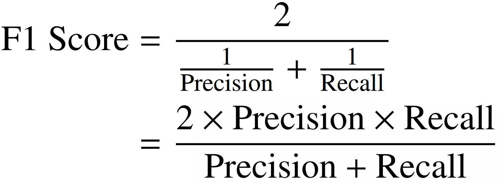

<div align="center">
    
  <a href="https://github.com/e0xextazy/nlp_huawei_new2_task/issues"></a>
  <a href="https://github.com/e0xextazy/nlp_huawei_new2_task/blob/master/LICENSE"></a>
  <a href="https://github.com/psf/black"></a>
    
</div>

# Practical Assignment 2: Text multiclass classification: store's review rating

## Contents
- [Practical Assignment 2: Text multiclass classification: shop's rating](#practical-assignment-2-text-multiclass-classification-shops-rating)
  - [Contents](#contents)
  - [Description](#description)
  - [Data](#data)
  - [Evaluation](#evaluation)
  - [Submission File](#submission-file)
  - [Usage](#usage)
  - [Contributing](#contributing)
    - [Issue](#issue)
    - [Pull request](#pull-request)
  - [Authors](#authors)

## Description
Your task is to classify the store's review rating into 5 classes. The metric is **F1-score**.

We present you 4 baseline solutions based on logistic regression, catboost, LSTM and Transformers. You can find them in their respective folders: `./baseline_tfidf_logreg`, `./baseline_catboost`, `./baseline_rnn` and `./baseline_transformers`. Each of these folders contains a file `requirements.txt` that will help you with the installation of the dependencies. To see the score and how many points you get if you can beat him, look at the table below:

| baseline    | Accuracy    | F1-score    | Points      |
| ----------- | ----------- | ----------- | ----------- |
| LogReg      | 0.5846      | 0.5178      | 12 points   |
| CatBoost    | 0.6455      | 0.6161      | 12 points   |
| LSTM        | 0.6227      | 0.6101      | 12 points   |
| Transformer | 0.6354      | 0.6286      | 12 points   |

If you will be the first in your group, you'll get 3 bonus points.

Please **DO NOT** develop your solution as a fork of this repository. Also please do not make it publicly available.

## Data

The dataset presented here was collected from one of the most popular maps. It contains reviews and ratings from 1 to 5 and we suggest you try to predict them.

- `train.csv` - The training set, comprising the `rate` and `text` of each review. `rate` comprise the target for the competition.
- `test.csv` - For the test data we give only the `text` of a review.
- `sample_submission.csv` - A submission file in the correct format.

You can download the dataset by following the [link](https://drive.google.com/drive/folders/1k-y7bLFXH94Y5pzUHYro1iTMsqsSoaHH?usp=sharing).

## Evaluation

Submissions are scored using F1-score:

<p align="center" width="100%">
    
</p>

## Submission File

For each row in the test set, you need to predict one of the 5 rates, from 1 to 5. The file should contain a header and have the following format:
```
index,rate
0,5
1,5
2,5
3,5
...
```

## Usage
1. Clonning repo: `git clone https://github.com/e0xextazy/nlp_huawei_new2_task.git`
2. `cd nlp_huawei_new2_task/`
3. Create virtual environment: `python3.7 -m venv venv`
4. Activate virtual environment: `source venv/bin/activate`
5. Setup your baseline:
   1. TF-IDF + Logistic Regression: `./setup/setup_tf_idf_logreg.sh`
   2. Catboost: `./setup/setup_catboost.sh`
   3. LSTM: `./setup/setup_lstm.sh`
   4. Transformers: `./setup/setup_transformers.sh`
6. Download data: `./setup/download_data.sh`
7. Enjoy!

## Contributing
Copy of the [`contributing.md`](https://github.com/e0xextazy/nlp_huawei_new2_task/blob/master/contributing.md).

### Issue
- If you see an open issue and are willing to do it, add yourself to the performers and write about how much time it will take to fix it. See the pull request module below.
- If you want to add something new or if you find a bug, you should start by creating a new issue and describing the problem/feature. Don't forget to include the appropriate labels.

### Pull request
How to make a pull request.
1. Clone the repository;
2. Create a new branch, for example `git checkout -b issue-id-short-name`;
3. Make changes to the code (make sure you are definitely working in the new branch);
4. `git push`;
5. Create a pull request to the `master` branch;
6. Add a brief description of the work done;
7. Expect comments from the authors.

## Authors
- [Mark Baushenko](https://t.me/kaggle_fucker)
- [Artyom Boldinov](https://github.com/limpwinter)
- [Milana Shkhanukova](https://github.com/MilanaShhanukova)
- [Nikita Safonov](https://github.com/sixxio)
